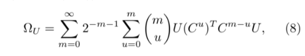
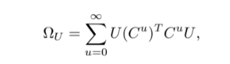

# NetworkSyncCapstone

**How does the structure of a network shape the synchronization of the noisy dynamical processes running on it?**

This capstone research project investigates the relationship between the topology of a
directed, weighted network and the ability of coupled dynamical systems on its nodes to
stay synchronized in the presence of noise. It combines an analytical measure of
synchronization, direct simulation of stochastic dynamics, and Markov Chain Monte Carlo
(MCMC) sampling to explore *which structural features (motifs) of a network make it
easier or harder to synchronize*.

<p align="center">
  
  
</p>

---

## The idea

Consider `N` coupled units, one per node of a network, each holding a state `x_i(t)`.
At every step each unit is pulled toward a weighted average of its neighbours (defined by
a **column-stochastic** coupling matrix `C`) while being perturbed by random noise. Two
dynamical regimes are studied:

- **Continuous** — an Ornstein–Uhlenbeck-like process, `dX = -X(I - C)·dt + dW`, where
  `dW` is a Wiener process.
- **Discrete** — `X(t+1) = X(t)·C + r(t)`, where `r(t)` is zero-mean unit-variance
  Gaussian noise.

Perfect synchronization corresponds to all states collapsing onto the consensus direction
`(1, 1, …, 1)`. To measure *how far from synchronized* the system is, we project the state
onto the space orthogonal to that consensus direction (using the centering matrix `U`) and
look at the variance that remains:

> **σ²** = (1/N) · trace(Ω_u)

where **Ω_u** is the *projected covariance matrix* of the steady-state fluctuations. A
smaller σ² means the network synchronizes better. Ω_u is computed **analytically** as a
convergent power series in `C` rather than by long simulation, which makes it cheap enough
to evaluate over many candidate networks.

---

## What's in here

### Core library (`.py` modules)

| Module | Purpose |
|---|---|
| `networkSigma.py` | The heart of the project. Builds the projected covariance matrix Ω_u (continuous & discrete) and computes the synchronization measure σ². Also provides `ProcessOnNetwork`, a class to **simulate** the stochastic dynamics and compare empirical vs. analytical σ². |
| `networkGenerator.py` | Generators for the networks under study: directed Erdős–Rényi, directed configuration model, stochastic block model (SBM), power-law degree networks, and helpers to make any graph **column-stochastic** (with optional random edge weights). |
| `measuresFunctions.py` | Computes structural measures of a network — average degree, degree variability, clustering (`Cnet`), diameter, average path length, largest clique, connected components, etc. — used to characterize sampled networks. |
| `metropolisHastings.py` | A **Metropolis–Hastings sampler** over the space of networks. Samples networks subject to a target constraint (e.g. a given clustering coefficient) so we can isolate the effect of individual structural features on σ². |
| `markovTransforms.py` | The MCMC moves used by the sampler — edge swaps and reconnections designed to preserve chosen invariants (number of nodes/edges, degree sequence, column-stochasticity). |
| `pickleUtil.py` | Small helpers to save/load results. |
| `globalParams.py` | Global configuration (e.g. the data output folder). |
| `src/` | Standalone / reworked versions of the sigma and graph-visualization code (`sigma.py`, `gvisu.py`). |

Each core module ships with a matching `*.test.py` test file.

### Notebooks

The notebooks are where the experiments, exploration and figures live:

- `experimentRunner.ipynb` — drives full experiments end to end.
- `NetworkSigma.ipynb` — develops and validates the σ² / Ω_u calculation.
- `metropolis.ipynb`, `metropolis2.ipynb`, `markovTransforms.ipynb`, `Metropolis/` — the MCMC sampling experiments.
- `toyModels.ipynb`, `test.ipynb` — small worked examples and sanity checks.
- `Force-Atlas2.ipynb`, `src/gvisu.ipynb` — large-scale network layout & visualization.
- `results.ipynb` — collected results and figures.

---

## Getting started

The project is built on the standard scientific-Python / network stack.

```bash
# core dependencies
pip install numpy scipy pandas matplotlib networkx

# for the graph-visualization notebooks
conda install -c conda-forge fa2
conda install -c anaconda datashader
# (optional, GPU-accelerated dataframes used by some visualizations)
conda install -c rapidsai cudf
```

A quick taste of the API:

```python
from networkGenerator import getDirectedColumnStochasticErdosRenyi
from networkSigma import continuousSigma2Analytical, ProcessOnNetwork

# build a random directed, column-stochastic network of 20 nodes
g = getDirectedColumnStochasticErdosRenyi(n=20, p=0.3)

# analytical synchronization measure
print("sigma^2 (analytical):", continuousSigma2Analytical(g))

# ...or simulate the dynamics and measure it empirically
proc = ProcessOnNetwork(g, discrete=False)
for _ in range(5000):
    proc.updateXs()
print("sigma^2 (empirical): ", proc.sigma_2_empirical())
```

### Running the tests

The `*.test.py` files exercise the core modules, e.g.:

```bash
python networkSigma.test.py
python networkGenerator.test.py
python markovTransforms.test.py
python metropolisHastings.test.py
python measuresFunctions.test.py
```

---

## Repository layout

```
NetworkSyncCapstone/
├── networkSigma.py            # σ² / projected covariance Ω_u + dynamics simulation
├── networkGenerator.py        # network generators (ER, config model, SBM, power-law)
├── measuresFunctions.py       # structural network measures
├── metropolisHastings.py      # Metropolis–Hastings network sampler
├── markovTransforms.py        # MCMC moves (edge swaps / reconnections)
├── pickleUtil.py, globalParams.py
├── src/                       # standalone sigma + graph visualization
├── Metropolis/                # additional MCMC experiments
├── *.ipynb                    # experiments, exploration and figures
└── *.test.py                  # tests for the core modules
```

---

## Notes

This is a research codebase: it grew alongside the investigation, so the notebooks capture
the exploratory work while the `.py` modules hold the reusable core. `questions.md` records
open questions raised during the research. Contributions and questions are welcome.
